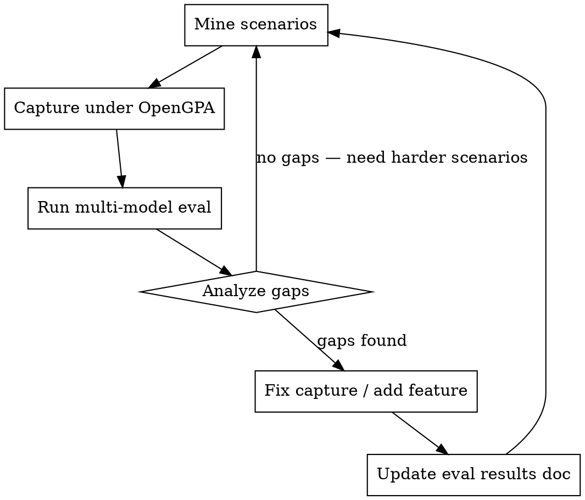

<!-- 
  This is a reference copy. The active skill lives at:
  ~/.claude/skills/eval-driven-improvement/SKILL.md
-->
---
name: eval-driven-improvement
description: Use when a feature/fix lands and you need to validate it actually helps, or when exploring whether OpenGPA covers a new bug class. Triggers on phrases like "run the eval", "does this help", "test the improvement", "next iteration".
---

# Eval-Driven Improvement

## Overview

Iterative loop: mine real bugs, evaluate OpenGPA's benefit vs code-only, fix gaps. The eval results drive what to build next — not hypotheses, not feature requests, not intuition.

## When to Use

- After any feature or fix lands
- When exploring a new class of graphics bugs
- When someone asks "does OpenGPA actually help with X?"
- When deciding what to build next

## The Loop



## Step 1: Mine Scenarios

Find real-world graphics bugs where:
- The symptom doesn't point to the root cause
- The root cause is a STATE problem (wrong binding, leaked state, wrong parameter)
- Runtime state inspection would directly reveal the issue
- It can be reproduced in a minimal GL app

Sources: GitHub issues (three.js, godot, bevy, wgpu, p5.js), Stack Overflow, engine bug trackers.

**Anti-pattern: synthetic toy bugs.** Single-file, 200-line apps with one obvious bug are too easy for any model. Real bugs come from multi-module state interactions.

**Anti-pattern: hint comments.** Source files must NOT contain `// BUG`, `// should be`, `// intentionally omitted`, or any comment that reveals the diagnosis.

## Step 2: Capture Under OpenGPA

```bash
# Start engine
python -m gla.launcher --socket /tmp/gla.sock --shm /gla --port 18080 --token TOKEN

# Capture scenario
LD_PRELOAD=bazel-bin/src/shims/gl/libgla_gl.so \
    GLA_SOCKET_PATH=/tmp/gla.sock GLA_SHM_NAME=/gla \
    bazel-bin/tests/eval/SCENARIO_NAME

# Verify data captured
curl -H "Authorization: Bearer TOKEN" localhost:18080/api/v1/frames/current/overview
```

Check that captured data is DIFFERENTIATED — different scenarios should produce different draw call counts, pipeline states, uniform values, and pixel colors. If all scenarios look identical, there's a capture bug.

## Step 3: Run Multi-Model Eval

Test across model tiers to find where GLA makes a difference:

| Model | Expected Code-Only | Expected With GLA |
|-------|-------------------|-------------------|
| Haiku (weak) | May fail on hard state bugs | Should recover with GLA data |
| Sonnet (medium) | Succeeds on most, slower on hard | Faster diagnosis with GLA |
| Opus (strong) | Succeeds everywhere | Confirms diagnosis with evidence |

**The key metric is not accuracy alone — it's accuracy x token cost.**

If all models get 100% in both modes, the scenarios are too easy. Go back to Step 1.

Dispatch eval agents with non-directive prompts:
- "Use whatever approach you think is best"
- Do NOT say "read the code first" or "query GLA first"
- Track tool_sequence to see what strategy the agent chooses

## Step 4: Analyze Gaps

After the eval, ask:
1. Did any model FAIL in code-only mode? If not, scenarios are too easy.
2. Did GLA data provide a UNIQUE signal? (Something code analysis can't determine)
3. Did agents fall into the framebuffer trap? (querying pixels before structured state)
4. What capture data was MISSING that would have helped?

The missing data directly becomes the improvement backlog:
- "r31 needs glClear tracking" → P2: intercept glClear
- "r5 needs FBO attachment info" → P3: track glFramebufferTexture2D
- "vec3 uniforms garbled" → P0: fix serialization

## Step 5: Fix and Repeat

Implement the highest-priority fix, then re-run the eval to verify it helps. Each iteration should either:
- Increase accuracy on previously-failing scenarios, OR
- Reduce token cost for previously-expensive diagnoses, OR
- Reveal that harder scenarios are needed (go to Step 1)

## Red Flags

| Flag | What It Means |
|------|---------------|
| All models 100% code-only | Scenarios too easy — mine harder ones |
| GLA agent doesn't use GLA tools | Scenarios solvable from code alone |
| Same capture data for all scenarios | Capture pipeline bug — fix before evaluating |
| Hints in source code | Eval is unfair — strip comments |
| Only testing one model | Can't measure capability-dependent benefit |
| Claiming improvement without re-running eval | Hypothesis, not evidence |

## Files

- Eval scenarios: `tests/eval/*.c` + `tests/eval/*.md`
- Eval results: `docs/eval-results.md`
- Multi-model runner: `scripts/run-multi-model-eval.py`
- Coverage gaps: `docs/superpowers/eval/coverage-gaps.md`
